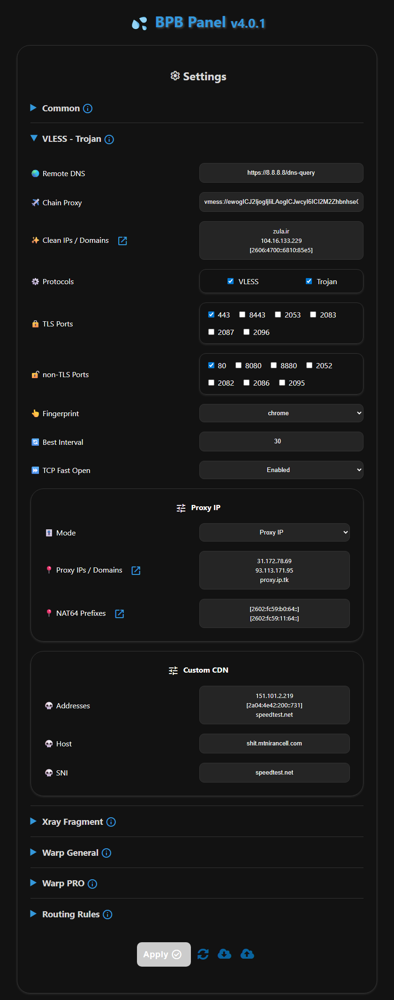

<h1 align="center">BPB 面板</h1>

### 🌏 语言: [English](README.md) | [Farsi (فارسی)](README_fa.md)

<p align="center">
  
</p>
<br>

**BPB 面板**是一个开源的多协议代理用户面板，旨在通过 Cloudflare Workers 或 Pages 部署，为您提供**免费**、**安全**且**私密**的网络访问。

---

## 📖 项目简介

该项目旨在提供一个简洁直观的用户面板，用于访问 **VLESS**、**Trojan** 和 **Warp** 配置。即使您的域名或 Warp 服务被运营商屏蔽，BPB 面板也能通过 Cloudflare 的基础设施确保连接的稳定性。

### 部署方式
- **Workers** 部署
- **Pages** 部署

🌟 如果您觉得 **BPB 面板** 对您有帮助，您的捐赠将是支持维护的最大动力 🌟

### USDT (BEP20)
```text
0xbdf15d41C56f861f25b2b11C835bd45dfD5b792F
```

---

## ✨ 核心功能

1. **免费且私密**：完全基于免费的 Cloudflare 资源，服务器私有 secure。
2. **直观面板**：极简方案，轻松完成导航、配置与使用。
3. **多协议支持**：集成 VLESS、Trojan 和 Wireguard (Warp) 协议。
4. **Warp Pro 配置**：针对核心网络环境特别优化的 Warp 配置。
5. **分片 (Fragment) 支持**：支持分片功能，提升在严苛网络环境下的连接能力。
6. **全面路由规则**：内置绕过中国、伊朗、俄罗斯路由，拦截广告、色情、恶意软件及钓鱼网站。
7. **链式代理 (Chain Proxy)**：支持通过链式配置（VLESS, Trojan, Shadowsocks, socks, http）固定 IP。
8. **广泛客户端兼容**：支持 Xray、Sing-box 和 Clash-Mihomo 内核客户端的订阅链接。
9. **密码保护**：面板受密码保护，确保私密访问。
10. **深度定制**：支持设置优选 IP/域名、代理 IP、DNS、端口协议以及 Warp 端点等。

---

## ⚠️ 局限说明

1. **UDP 传输**：由于 Cloudflare Workers 的限制，VLESS 和 Trojan 协议无法原生支持完整的 UDP 传输（例如 Telegram 视频通话），且不支持 UDP DNS。默认启用 DoH 以增强安全性。
2. **请求限制**：每个 Worker 每天支持 10 万次 VLESS/Trojan 请求，建议 2-3 名用户共享。Warp 配置不受此限制。

---

## 🚀 快速入门

详细的文档说明可在线访问：

- [🛠️ 安装教程](https://git186404.github.io/BPB-Worker-Panel-CN/installation/wizard/)
- [⚙️ 配置说明](https://git186404.github.io/BPB-Worker-Panel-CN/configuration/)
- [📖 如何使用](https://git186404.github.io/BPB-Worker-Panel-CN/usage/)
- [❓ 常见问题](https://git186404.github.io/BPB-Worker-Panel-CN/faq/)

---

## 📱 支持的客户端

| 客户端 | 版本要求 | 分片 (Fragment) 支持 | Warp Pro 支持 |
| :--- | :--- | :---: | :---: |
| **v2rayNG** | 1.10.26 或更高 | ✅ | ✅ |
| **MahsaNG** | 14 或更高 | ✅ | ✅ |
| **v2rayN** | 7.15.4 或更高 | ✅ | ✅ |
| **v2rayN-PRO** | 1.9 或更高 | ✅ | ✅ |
| **Sing-box** | 1.12.0 或更高 | ✅ | ❌ |
| **Streisand** | 1.6.64 或更高 | ✅ | ✅ |
| **Clash Meta** | 最新版 | ❌ | ✅ |
| **Clash Verge Rev** | 最新版 | ❌ | ✅ |
| **FLClash** | 最新版 | ❌ | ✅ |
| **AmneziaVPN** | 最新版 | ❌ | ✅ |
| **WG Tunnel** | 最新版 | ❌ | ✅ |

---

## 🛠️ 环境参数 (Settings)

| 变量名 | 用途 | 必填 |
| :--- | :--- | :---: |
| **UUID** | VLESS 用户唯一标识符 | ✅ |
| **TR_PASS** | Trojan 连接密码 | ✅ |
| **PROXY_IP** | 代理 IP 或域名 (用于 VLESS, Trojan) | ❌ |
| **PREFIX** | NAT64 前缀 (用于 VLESS, Trojan) | ❌ |
| **SUB_PATH** | 订阅链接的唯一路径 | ❌ |
| **FALLBACK** | 访问主页时的回落域名 | ❌ |
| **DOH_URL**  | 内核使用的 DoH 地址 | ❌ |

---

## 🌟 星标趋势

[](https://starchart.cc/bia-pain-bache/BPB-Worker-Panel)

---

### 鸣谢

- 参考了 [yonggekkk](https://github.com/yonggekkk) 开发的 [Cloudflare-workers/pages proxy script](https://github.com/yonggekkk/Cloudflare-workers-pages-vless)
- 感激 CF-vless 初始作者 [3Kmfi6HP](https://github.com/3Kmfi6HP/EDtunnel)
- 感激 CF 优选 IP 工具作者 [badafans](https://github.com/badafans/Cloudflare-IP-SpeedTest) 和 [XIU2](https://github.com/XIU2/CloudflareSpeedTest)
